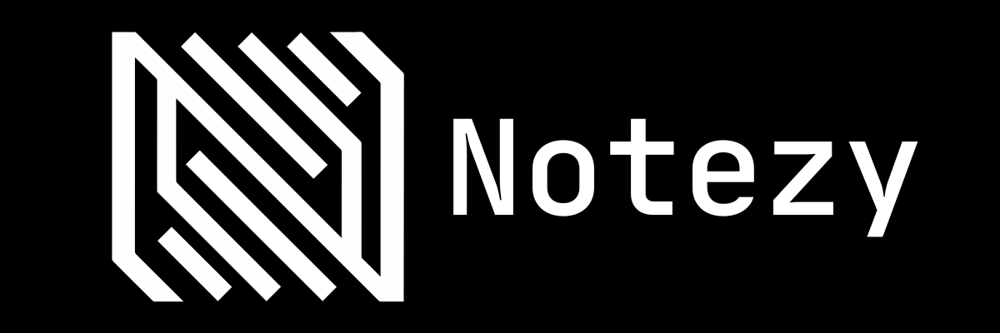

<a></a>

# Notezy Backend

Notezy Backend is the server-side application for Notezy. It is a modular,
multi-runtime Go backend with a dedicated TypeScript Yjs worker. The repository
is currently maintained as a proprietary project; it is not the old open-source
starter architecture.

## Architecture

The system separates public traffic, core business operations, realtime
connections, and asynchronous workers into independently runnable runtimes:

| Runtime | Responsibility |
| --- | --- |
| `internal/gateway` | Public HTTP/GraphQL entry point, client cookies, request safety, and internal Core adapter calls. |
| `internal/core` | PostgreSQL-backed business operations, authorization, repositories, cache ownership, and transactional outbox publishing. |
| `internal/realtimegateway` | Realtime/WebSocket gateway, ticket verification, connection admission, realtime leases, presence, and YjsWorker connections. |
| `internal/durablejob` | Durable-job consumers and scheduling strategies. Core remains the owner of database-backed task state. |
| `internal/email` | Email delivery runtime and message templates. |
| `internal/yjsworker` | TypeScript Yjs document, projection, persistence, and compaction worker. |

The main request paths are:

```text
Client HTTP/GraphQL
    -> Gateway
    -> Core
    -> PostgreSQL / Redis

Client WebSocket
    -> RealtimeGateway
    -> YjsWorker

Core
    -> transactional outbox
    -> Kafka
    -> DurableJob / Email / Realtime consumers
```

Gateway and RealtimeGateway are separate public edges. Realtime traffic does
not pass through the HTTP Gateway. Core owns business authorization and durable
state; RealtimeGateway owns connection state and realtime Redis data.

## Repository layout

```text
contracts/                         Versioned cross-runtime contracts
  core/v1/                          Core API, events, and GraphQL contracts
  durablejob/v1/                    DurableJob contracts
  email/v1/                         Email contracts
  gateway/v1/                       Gateway request/response envelope
  realtime-gateway/v1/              RealtimeGateway contracts
  yjs-worker/v1/                    YjsWorker contracts
  types/                            Portable shared contract shapes

internal/
  cli/                              Shared Cobra command runner
  gateway/                          Public HTTP/GraphQL gateway
  core/                             Core runtime and data ownership
  realtimegateway/                  Realtime/WebSocket gateway runtime
  durablejob/                       Durable-job runtime
  email/                            Email runtime
  yjsworker/                         TypeScript Yjs runtime

shared/                             Cross-runtime platform and utilities
test/                               Architecture, integration, load, and soak tests
infra/                              Nginx, staging, observability, and deployment files
docs/                               Architecture, conventions, contracts, and runbooks
```

Each Go runtime has its own `go.mod`, Dockerfile, application composition root,
and Cobra commands. Runtime code must not import another runtime's source. The
`contracts` and `shared` modules are the supported cross-runtime boundaries.

## Local development

### Prerequisites

- Go `1.26.x`
- Docker and Docker Compose
- Node.js `22.x` and pnpm `11.x` for `internal/yjsworker`
- A local `.env` containing the required database, Redis, Kafka, token, OAuth,
  SMTP, and observability settings

### Start the development stack

```sh
docker compose up --build -d --wait
make -C internal/core migrate
make -C internal/core seed
```

`docker compose up` is attached to the service logs by default and is intended
to remain running. The `-d` flag runs the stack in the background, while
`--wait` makes Compose wait until services are running or healthy and return a
failure status if they cannot become ready. Use `docker compose ps` to inspect
the result and `docker compose logs -f <service>` to follow one service.

For a production-like local stack:

```sh
docker compose --project-name notezy-prod-local \
  --project-directory . \
  --env-file .env \
  -f infra/docker/docker-compose.prod.yaml \
  up --build -d --wait
```

The production-like stack is a local pre-deployment check; it does not replace
staging or production validation against managed infrastructure, real secrets,
TLS termination, DNS, resource limits, or network policies. See the
[Docker local development runbook](docs/runbooks/docker-local-development.md)
for the complete workflow and cleanup commands.

### Tests and quality checks

The root Makefile is the single command surface used by local development,
GitHub Actions, and Jenkins:

```sh
make ci-format
make ci-vet
make ci-unit
make ci-race
make ci-generated
make ci-containers
```

Docker-backed tests are intentionally separate from ordinary pull-request
checks:

```sh
make test-integration
make test-integration-kafka
make test-load-websocket
make test-soak-websocket
make test-load-kafka-lag
```

The root Compose targets manage the repository's Compose test stack
(`infra/docker/docker-compose.integration.yaml`). The test targets themselves only execute
tests, so they can also be run against an already-running local stack:

```sh
make compose-integration-up
make test-integration
make test-integration-kafka
make compose-integration-down
```

For a complete local lifecycle, use `make test-integration-managed`; it starts
the stack, runs both integration suites, and removes the stack even when a test
fails. CI uses the explicit `compose-integration-up` and
`compose-integration-down` targets so setup and cleanup remain visible in the
workflow logs.

### GraphQL contracts

GraphQL schema and generated artifacts are Core-owned:

```sh
make -C contracts gql-generate
make -C contracts gql-regenerate
```

Generated files are checked in and CI verifies that regeneration leaves a clean
working tree.

## CI/CD and Jenkins

GitHub Actions is the primary repository automation:

- `ci.yml` runs format, vet, unit, race, generated-contract, and container gates
  for pull requests, protected branches, and version tags.
- `integration.yml` runs scheduled or manually triggered PostgreSQL/Redis/Kafka
  integration verification.
- `staging.yml` promotes an immutable GHCR image tag on an approved staging
  self-hosted runner and checks `/startedz` and `/healthz` for every runtime.

Jenkins is an optional self-hosted pipeline executor, not another Notezy
runtime. The root `Jenkinsfile` deliberately calls the same Makefile targets as
GitHub Actions. It is useful when an organization needs an on-premise runner,
private network access, a separate approval system, or an existing Jenkins
credential store. Its staging stage promotes an already-built immutable GHCR
tag; it does not rebuild source on the staging host. Jenkins credentials provide
GHCR access and deployment secrets, while the repository contains no secret
values.

Staging commands are shared by both systems:

```sh
IMAGE_REGISTRY=ghcr.io/ORG/REPO IMAGE_TAG=TAG \
COMPOSE_ENV_FILE=/etc/notezy/staging.env make staging-deploy
make staging-smoke
```

Formal production rollout, migration rollback, and disaster recovery are
separate operational work and are not implied by a successful staging run.

## Documentation

- [Microservice architecture](docs/codebase-design/microservice-architecture.md)
- [CI/CD pipeline](docs/codebase-design/ci-cd-pipeline.md)
- [Project conventions](docs/conventions/README.md)
- [Kafka local development](docs/runbooks/kafka-local-development.md)
- [Transactional outbox](docs/system-design/transactional-outbox.md)
- [Realtime protocol](docs/system-design/realtime-protocol.md)

## Licensing

Project code is distributed under the Notezy proprietary license:

- `LICENSE.md` — English
- `LICENSE(tw).md` — Traditional Chinese

Third-party notices and license texts are preserved under `LICENSES/`.
