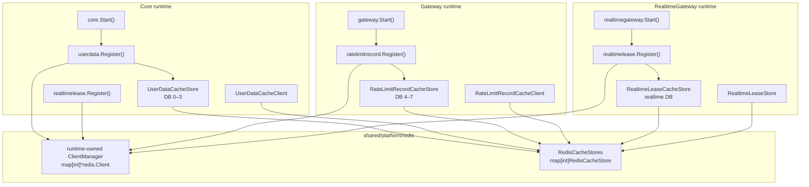

# Microservice Architecture Migration

## Purpose

Notezy adopts a staged migration rather than a one-time domain/database split. `Core` remains the synchronous owner of the current user, shelf, block, routine, and station workflows until a later bounded-context decision proves a separate runtime and database are warranted.

## Target ownership

```text
internal/
 gateway/commands/
 core/commands/
 realtimegateway/commands/
 durablejob/commands/
 email/commands/
contracts/
  gateway/v1/              # Gateway-owned private request/response envelope
  core/
    v1/
      api/                 # Core-owned HTTP and GraphQL operation DTOs
      events/              # Core-owned Kafka lifecycle event contracts
      graphql/             # Core-owned GraphQL schema and generated artifacts
      types/               # Core-only reusable DTO shapes
  types/
    enums/                 # Canonical cross-runtime enum values
    editable_block.go      # Arborized input tree and raw flattened persistence shape
    *_routine_task_payload.go
  durablejob/v1/           # DurableJob-owned internal boundary
  email/v1/                # Email-owned internal boundary
  realtime-gateway/v1/     # RealtimeGateway-owned internal boundary
  yjs-worker/v1/           # YjsWorker-owned internal boundary
internal/
  gateway/
    transports/
      api/
        binders/
        controllers/
        cookies/
        interceptors/
        middlewares/
        routes/
      core/
        adapters/
      realtimegateway/
        adapters/
  realtimegateway/           # standalone WebSocket edge runtime
    data/cache/              # Realtime leases and Realtime-specific rate limits
    transports/
      gateway/               # private API Gateway presence transport
      yjsworker/             # WebSocket client, connection/channel state, middleware
    workers/                 # YjsWorker connection manager
  core/
    data/
      database/             # schemas, repositories, scopes, SQL, seeds, options
      cache/                # Core-owned Redis caches and Lua libraries
      storage/              # Core-owned storage implementations
    services/
      routines/
        handlers/            # RoutineTask aggregate execution handlers
        resolvers/           # RoutineTask and block-pattern resolution
        parsers/             # RoutineTask payload decoding and flattening
        matchers/            # RoutineTask template matching
    workers/                # Core-owned long-lived reconciliation and background loops
  durablejob/               # independent runtime; no direct database access
    transports/core/        # Core-facing Kafka consumers and producers
      strategies/           # DurableJob maintenance scheduling policy
  email/                    # independent runtime and SMTP sender
  yjsworker/                # standalone TypeScript runtime; no src/ layer
    configs/                # runtime tuning and environment-backed settings
    transports/             # Core HTTP/Kafka and Realtime WebSocket boundaries
      core/
        endpoints/
        routers/
        consumers/
        dispatchers/
      realtime/
      health/
    services/               # Yjs transformation and projection application logic
    types/                  # runtime data shapes; versioned contracts live in contracts/
shared/
  exceptions/                # base exception envelope and rendering helpers
  platform/                  # database, Redis, Kafka, and observability lifecycle
  cookies/                    # reusable Gin access/refresh cookie handlers
  tokens/                    # access, refresh, delegation, and realtime tokens
  util/
    editableblock/            # tree-to-row EditableBlock conversion
    exceptionwriter/          # public exception formatting
    responsewriter/           # shared HTTP response buffering
  constants/ types/ validations/
  lib/                       # portable libraries, including BlockNote schemas
docs/
infra/
tests/
```

Directories are created only when they receive an owned implementation. Runtime
composition roots and Cobra commands live under their owning runtime's `commands/`
directory (`internal/gateway/commands/`, `internal/core/commands/`, and so on). GraphQL
SDL, generated artifacts, and generator configuration live under
`contracts/core/v1/graphql/`. Later issues establish the remaining owners; no
empty directory tree is committed merely to mirror this diagram.

## Runtime module boundaries

Each Go runtime and each cross-runtime support layer owns an independent module:

```text
contracts/go.mod
shared/go.mod
internal/core/go.mod
internal/gateway/go.mod
internal/durablejob/go.mod
internal/email/go.mod
internal/realtimegateway/go.mod
test/go.mod
```

Each module has its own `go.sum` and can be tested or built from its directory
without inheriting another runtime's module metadata. `go.work` at the
repository root composes the modules for local development. The `test` module
uses local `replace` directives to import the modules it tests; this keeps
integration and architecture tests from introducing a dependency from a runtime
back into the repository root. A root-level `go test ./...` is therefore not a
supported command; use `make test-all` (or run it from `test/`). DurableJob's
execution protocol is carried by versioned contracts; Core remains the sole
owner of database-backed task execution and state transitions.
YjsWorker remains a separate Node/TypeScript environment. It follows the same
runtime layering as the Go services: `transports/` contains Core-facing HTTP and
Kafka boundaries plus the Realtime WebSocket boundary, `services/` contains Yjs
transformation logic, `types/` contains runtime shapes, and `configs/` contains
runtime policies. Protocol constants and their versioned TypeScript counterpart
are owned together by `contracts/yjs-worker/v1`; the planned Go-to-TypeScript
contract generator will keep the two definitions synchronized. Eviction and
batching values remain runtime policy and therefore stay in `configs/` rather
than the cross-runtime contract.

## Dependency direction

```text
runtime commands -> owning internal runtime
gateway -> contracts + shared
gateway -X-> service data/repository
internal/<runtime>/* -> contracts + shared + own data
internal/<runtime>/* -X-> another runtime's source
shared/lib -X-> all Notezy packages
shared/platform -X-> domain business packages
```

`shared/lib` is portable: it may use the standard library and a necessary third-party library, but never imports a Notezy package. `shared/util` contains reusable application-facing utilities such as `editableblock`, `exceptionwriter`, and `responsewriter`; unlike `shared/lib`, these utilities may depend on shared application packages. Shared parsers return ordinary Go `error`; application boundaries map those errors to service exceptions.

## Shared contract types

`contracts/types/enums` is the canonical owner of cross-runtime enum values.
Core and DurableJob database enum wrappers import those values and add only the
PostgreSQL responsibilities (`Name`, `Scan`, `Value`, validation, and string
conversion); neither runtime redefines a value set.

`contracts/types/blocknote/editable_block.go` has exactly two EditableBlock shapes:
`ArborizedEditableBlock` is the recursive, validated transport tree, while
`RawFlattenedEditableBlock` is the persistence/projection row with parent and
sibling identifiers plus raw JSON props/content.
`shared/util/editableblock.FlattenEditableBlock` and
`shared/util/editableblock.FlattenEditableBlocks` convert the former to the latter. There are
no generic `ArborizedBlock`, `RawArborizedEditableBlock`, or duplicate
`FlattenedEditableBlock` types.

DurableJob-owned RoutineTask execution payloads live under
`contracts/durablejob/v1/types/routine-tasks/`. Core validates and persists the
protocol boundary while DurableJob handlers consume it without importing Core
source. Only genuinely portable structures, such as EditableBlock shapes,
remain under `contracts/types/`. BlockNote schemas remain portable in
`contracts/types/blocknote`.

Core-owned reusable DTO shapes under `contracts/core/v1/types/<domain>/` use
the package name `coretypes`. Each domain folder remains an independent Go
package; callers use explicit domain aliases only when multiple folders are
imported by one file.

## Public and internal transport

Client-facing HTTP uses `routes -> binders -> controllers -> Core service
adapter`. Binders own URI/query/header/body binding and transport validation;
controllers invoke an adapter and render the client-safe response. Client-only
cookies, middlewares, and interceptors remain under the same `api` transport.
Neither layer owns transactions, business workflows, or persistence queries.

Gateway internal-API adapters are outbound clients reusable by REST and
GraphQL. They live in
`internal/gateway/transports/core/adapters/`; client transport code must
not contain Core service client implementation. Core transports are
inbound adapters: they verify the internal delegation credential, map a
versioned request to a Core service call, and map the service result to a
versioned response. Core adapters exist only for Core outbound calls to another
runtime.

Core's inbound Gateway transport is organized as
`internal/core/transports/gateway/endpoints/` and
`internal/core/transports/gateway/routers/`. Endpoints own the
delegated request/service/response flow; routers only bind HTTP paths and
methods. Delegation and Core-owned authorization middleware belongs in
`internal/core/transports/gateway/middlewares/`. Tests live beside
their endpoint, router, or middleware target.

`internal/gateway/commands`, `internal/core/commands`, and
`internal/realtimegateway/commands` are independent composition
roots. API Gateway accepts HTTP and GraphQL browser traffic only; Core owns
PostgreSQL-backed operations and its private listener; RealtimeGateway is the
separate WebSocket edge runtime, directly addressed by the Nginx WebSocket
upstream. RealtimeGateway owns connection admission, ticket verification, Redis
leases, Realtime-specific rate limits, and long-lived Go-to-YjsWorker
connections. Its root `application.go` is the composition root: each `Start()`
creates a new WebSocket client with its own connection state; no
global singleton application instance is retained. It never constructs Core
repositories or services.

NOT-57 adds `internal/durablejob/commands` and `internal/email/commands` as independent
composition roots.
DurableJob is an independent process. Its RoutineTask handlers only validate,
decode, and prepare versioned assignments; Core owns all database-backed task
execution and state transitions. DurableJob therefore has no import path to
Core's schemas, repositories, scopes, or services. It publishes prepared
completion/failure results through the DurableJob contracts, and Core applies
them through one transaction-owned application/data boundary. Email owns its SMTP sender and queue and consumes
Core's versioned Kafka email request contract; its HTTP transport exposes only
started/health endpoints. Both
commands initialize observability and stop their workers/HTTP servers on
context cancellation or SIGTERM.

RealtimeGateway owns socket admission, tickets, leases, connection state, and
worker forwarding. Core owns authorization, durable Yjs state, and block
projection, but RealtimeGateway does not synchronously call Core for those
operations. YjsWorker sends its persistence and projection commands to Core
through Kafka; Core publishes lifecycle facts through its transactional outbox.

The Gateway extracts and cryptographically parses browser access/refresh tokens
without querying Core data, then applies route permission policy. It sends a
short-lived internal delegation credential containing the calling component as
`actor`, an authenticated user's public UUID as the optional `userSubject`,
request/trace identity, and allowed permissions. For secure calls it also
forwards browser cookies, User-Agent, and sanitized forwarding metadata through
the private client. Core validates both the delegation credential and the
forwarded browser token, then resolves its own internal user identity. Core
inbound routes use `DelegationMiddleware` for component-only operations and
`DelegationAuthenticatedMiddleware` when a user subject is required. Go
`context.Context` is never serialized as an internal transport contract.

The versioned Core `Response[D]` envelope carries only operation data. A
short-lived signed BlockPack channel ticket carries the room-admission policy
snapshot required by the WebSocket runtime: policy version, admission enforcement
strategy, and maximum subscribers. RealtimeGateway verifies that ticket and uses
the attested strategy and maximum-subscriber claim directly for atomic Redis lease
admission; it does not persist a Core-owned room-policy cache or expose internal
instructions through the public API.

## GraphQL

GraphQL follows Scheme A. The Gateway owns GraphQL execution, resolvers, and dataloaders. Resolvers call Core transports through Gateway adapters; they never access Core repositories, GORM schemas, or data packages directly.

GraphQL SDL, fragments, operation documents, generated Go artifacts, generated models, and scalar infrastructure belong in `contracts/core/v1/graphql/`. Generated files are never edited directly.

## Data cache ownership

Redis is divided into three explicit responsibilities: platform client lifecycle,
runtime-owned cache registration, and domain-specific cache operations.



### Platform lifecycle

`shared/platform/redis` owns no cache domain or business policy. Its
`ClientManager` is the sole owner of Redis connection creation, lookup, and
shutdown for the current process. It maintains `map[int]*redis.Client`, keyed
by Redis database number.

`RedisCacheStore` is the initialization boundary for a concrete database store:

```go
type RedisCacheStore interface {
    DatabaseNumber() int
    Initialize(ctx context.Context) error
}
```

`RegisterCacheStores()` first calls each store's `Initialize()` and only
registers successful stores in `RedisCacheStores`. Consequently, a failed Lua
library load never leaves an apparently usable cache store in the registry.

Each executable creates and owns its own process-local `ClientManager` and
`RedisCacheStores` registry. Core, Gateway, and RealtimeGateway therefore have their
own Redis TCP connections even when they target the same Redis server and DB
numbers.

### Runtime ownership

| Runtime | Registration | Redis ownership |
|---|---|---|
| Core | `userdata.Register()` | User data and quota cache, DB 0–3 |
| Gateway API | `ratelimitrecord.Register()` | API rate-limit records, DB 4–7 |
| RealtimeGateway | `realtimelease.Register()` + `ratelimitrecord.Register()` | Connection/channel leases, participant presence, Realtime rate-limit records, lifecycle Pub/Sub fan-out |
| DurableJob / Email | None currently | No registered Redis cache domain |

`UserDataCacheStore` and `RateLimitRecordCacheStore` each own a single
`*redis.Client` and their cache library loading. Their matching `*CacheClient`
types own key formatting, routing, and cache operations; they retrieve a store
from the platform registry rather than keeping a Redis client map themselves.

Core quota functions are one-function-per-file under
`internal/core/data/cache/userdata/libraries/`. The UserData store
embeds and joins them into one `user_quota_library`, then performs a single
`FUNCTION LOAD REPLACE` during `Initialize()`.

### Registration and operation flow

```text
core.Start()
  -> clientManager := redis.NewClientManager(config)
  -> userdata.Register(ctx, clientManager)
    -> ConnectAll(DB 0–3)
    -> NewUserDataCacheStore(DB, client)
    -> RegisterCacheStores(stores...)
      -> store.Initialize()
        -> FUNCTION LOAD REPLACE user_quota_library
      -> RedisCacheStores[DB] = store

Auth/User service
  -> UserDataCacheClient.Get/Set/Update(...)
    -> hash identifier -> database number
    -> GetRedisCacheStore(databaseNumber)
    -> UserDataCacheStore.redisClient
```

`internal/realtimegateway/data/cache/realtimelease/` owns the RealtimeGateway
runtime's user
connection and BlockPack subscriber lease lifecycle, active lease inspection,
participant presence, and presence PubSub fanout. A Core-issued BlockPack
channel ticket carries the signed policy version, reject-new-subscriber strategy,
and maximum-subscriber policy snapshot; RealtimeGateway uses those verified claims
directly during atomic admission.
Core authorizes channel admission when it issues a signed ticket, but it does
not participate in RealtimeGateway subscribe or write boundaries and does not
read RealtimeGateway Redis or the live subscriber count during ownership or
plan workflows. RealtimeGateway applies the ticket's verified channel policy;
its Lua scripts are private to that cache domain.

RealtimeGateway owns the lease cache and produces participant snapshots and
deltas. Its lifecycle Kafka consumer publishes received revocations to its local
Redis Pub/Sub channel so every RealtimeGateway instance detaches only its own
matching connections and releases their leases. Clients request the ephemeral
participant snapshot directly from RealtimeGateway; API Gateway does not proxy
the request and Core never reads RealtimeGateway-owned lease/cache state. Core's
lifecycle path is outbox → Kafka → RealtimeGateway.

`internal/core/data/storage/` owns Core's storage implementation;
Gateway does not access it directly.

## Lifecycle event contracts

The runtime-neutral envelope is defined in
[`contracts/types/events/`](../../contracts/types/events/). It contains no topic, consumer
group, or business payload, so `shared/platform/kafka` can consume any
runtime's event without importing that runtime's contracts. Runtime-owned event
families are kept at their boundaries:

- [`contracts/core/v1/events`](../../contracts/core/v1/events/) contains Core
  lifecycle facts and policy decisions consumed by RealtimeGateway.
- [`contracts/durablejob/v1/events`](../../contracts/durablejob/v1/events/)
  contains RoutineTask and DurableJob-to-Core Yjs maintenance coordination.
- [`contracts/core/v1/events`](../../contracts/core/v1/events/)
  contains Core-owned lifecycle facts and Yjs maintenance hints.
- [`contracts/yjs-worker/v1/events`](../../contracts/yjs-worker/v1/events/)
  contains YjsWorker command/reply transport metadata and maintenance
  operations.

Core owns the facts and policy values in its lifecycle messages.
RealtimeGateway consumes them to execute detach or future admission behavior,
but never derives business rules. The event envelope is independent of the
Kafka client, outbox schema, and consumer implementation so NOT-34, NOT-35,
and NOT-33 can evolve those owners without changing the semantic boundary.

## Exceptions and lifecycle

`contracts/types/exceptions` contains only the base exception envelope and origin
classification. Core domain factories stay in
`internal/core/exceptions/`; Gateway-only failures use the base envelope
at their use site. They return the base envelope but are never imported across a
Gateway/service boundary. Gateway transport owns client-safe HTTP exception
rendering. Portable shared libraries and parsers never import or return an
application exception.

Kafka, transactional outbox, consumer reliability, and cross-Gateway event
fanout are Phase 3 concerns. Core writes a service-owned outbox record in the
same transaction as a lifecycle mutation; WebSocket consumes the resulting
event and only executes the already decided detach/policy action. Yjs updates,
awareness, presence, and Redis leases remain ephemeral transport traffic and do
not enter the outbox.

The platform Kafka client owns broker configuration, TLS/SASL setup, broker
health checks, and common telemetry names. Core and RealtimeGateway may run
in degraded mode when Kafka is unavailable, but their `/healthz` endpoints stay
unhealthy until the runtime can accept normal operations. Local provisioning and operational steps
are documented in [Kafka Local Development](../runbooks/kafka-local-development.md).

Core's PostgreSQL-to-Kafka handoff is a Core-owned transactional outbox. Domain
transactions persist `OutboxEventTable` rows before committing; a Core worker
claims rows with `FOR UPDATE SKIP LOCKED`, publishes the versioned event
envelope, and marks acknowledgements. This deliberately provides at-least-once
delivery, with consumer idempotency owned separately. See the
[transactional outbox design](../system-design/transactional-outbox.md).
