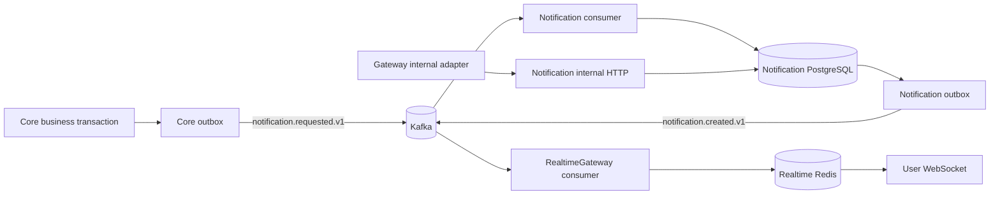

# Notification runtime

Notification is an independent runtime with its own PostgreSQL database. Core
does not write Notification tables: a Core business transaction writes a
`NotificationRequested` event into the Core outbox, and the Core relay publishes
`notezy.core.notification.v1`.

The Notification database stores a fixed notification envelope and a JSONB
payload. `dedupe_key` is unique, and the incoming Core `event_id` is recorded in
the inbox table. Both records and the Notification outbox row are written in a
single database transaction. Reprocessing a Kafka event therefore has no
additional side effect.

Type-specific payloads are defined under
`contracts/notification/v1/types/`. Each payload is a typed contract struct
with its `validate` tags. The runtime's
`internal/notification/validations/` package only registers the custom
`validator/v10` functions referenced by those tags. The Notification
application registers shared and notification validators once, then injects
the configured validator into `NotificationService`, which calls
`s.validator.Struct(...)` after decoding each payload. The shared
NotificationService dispatches by notification type, template key, and
template version; private notification search, unread, read, and delete
queries stay in the shared repository and never iterate over type-specific
services. Private search uses a GraphQL-style opaque composite cursor over
`created_at` and `id`, with a matching descending database order.

The runtime exposes internal endpoints for private search, unread count, mark-read, and
soft-delete operations. The Gateway remains the public authentication boundary;
the Notification internal router verifies the delegated token, and the Gateway
adapter injects the authenticated `user_public_id` into these internal requests.
The public Gateway routes never trust a client-selected identity and do not
expose the Notification runtime's internal endpoints directly.

Notification cleanup hard-deletes expired records and old soft-deleted records.
User deletion creates a durable tombstone in `UserDeletionTable`, deletes the
user's existing notifications in the same transaction, and causes later
notification requests for that public ID to be ignored. This prevents delayed
Kafka requests from recreating notifications after account deletion.
RealtimeGateway only consumes the created event and keeps the live-delivery
copy in its own Redis; it does not query the Notification database.

Kafka consume, retry, publish, consumer-lag, and dead-letter metrics are
exported through the shared OpenTelemetry Kafka instrumentation. The
`infra/monitor/grafana/dashboards/notification-overview.json` dashboard and
`infra/monitor/alerts/notification-alert-rules.yaml` alert group cover the
Notification and lifecycle topics without requiring the Notification runtime
to import monitoring-specific code.

Core's registration flows currently exercise the producer path by enqueueing a
deduplicated welcome news notification in the same transaction as the new user
records. Account deletion also writes a `UserDeleted` lifecycle event in the
same Core transaction; Notification consumes it idempotently and removes that
user's persisted notifications. Other Core business notifications should use
the same outbox repository method and transaction boundary.
